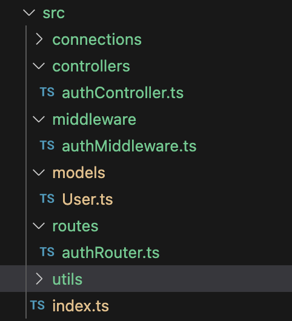

In this article, we’ll create a **ExpressJS** backend with **TypeScript**, implement **authentication** and create a **custom middleware** to validate user authentication and to handle errors. We’ll use **MongoDB** to store our user data.

We’ll be implementing token based authentication using **JWT tokens.** We’ll use **cookies** to store the token.

### 1. Creating the ExpressJS application with TypeScript

You can follow below steps to create a simple Express backend with TypeScript.

Create a folder for the backend application and run the following commands in the terminal to initialize a NodeJS project and to install the dependencies.

```bash
npm init -y
npm install express
npm install typescript @types/node @types/express ts-node nodemon --save-dev
```

Run below command to create a **tsconfig.json** file.

```bash
npx tsc --init
```

Make sure the following are uncommented in the file, with the given values.

```json
{
  "compilerOptions": {
    "target": "ES6",
    "module": "CommonJS",
    "outDir": "./dist",
    "rootDir": "./src",
    "strict": true,
    "esModuleInterop": true,
    "skipLibCheck": true
  }
}
```

Create a **src** folder and include **index.ts** file with following initial implementation.

```ts
import express from 'express';

const app = express();
const port = process.env.PORT || 8000;

app.listen(port, () => {
  console.log(`Server is running on port ${port}`);
});
```

Include the following scripts in package.json.

```
"scripts": {
    "start": "node dist/index.js",
    "dev": "nodemon src/index.ts",
    "build": "tsc"
  }
```

Now you can up the server locally by running below command. Since we’re using **nodemon** (installed previously), each time we do a change in the code and save, the server will be automatically updated.

```bash
npm run dev
```

Now you have a Express server up and running locally. Let’s add the routes and the implementations associated with the register, login and logout processes.

### 2. Add authentication implementation for the backend

Create the following folder/file structure and add the initial code as below for each file.



_Folder and file structure for backend_

For authController.ts,

```ts
import { Request, Response } from "express";

const registerUser = (req: Request, res: Response) => {};

const authenticateUser = (req: Request, res: Response) => {};

const logoutUser = (req: Request, res: Response) => {};

export { registerUser, authenticateUser, logoutUser };
```

For authRouter.ts,

```ts
import express from "express";
import {
  registerUser,
  authenticateUser,
  logoutUser,
} from "../controllers/authController";

const router = express.Router();

router.post("/register", registerUser);
router.post("/login", authenticateUser);
router.post("/logout", logoutUser);

export default router;
```

Update the **index.ts** file as below, importing and using authRouter.

```ts
import express from "express";
import authRouter from "./routes/authRouter";

const app = express();
const port = process.env.PORT || 3000;

app.listen(port, () => {
  console.log(`Server is running on port ${port}`);
});

app.use(authRouter);
```

Let’s install **jsonwebtoken** library to work with **JWT tokens**, and **bcryptjs** to hash the password.

```bash
npm i bcryptjs jsonwebtoken
npm i -D @types/bcryptjs @types/jsonwebtoken
```

We’re using **mongoose**, which enables us to work with **MongoDB** in NodeJS environment.

```bash
npm i mongoose
```

Now, let’s create User.ts model to include the properties and methods of User objects.

```tsx
import mongoose, { Document, Schema } from "mongoose";
import bcrypt from "bcryptjs";

export interface IUser extends Document {
  name: string;
  email: string;
  password: string;
  comparePassword: (enteredPassword: string) => boolean;
}

const userSchema = new Schema<IUser>({
  name: {
    type: String,
    required: true,
  },
  email: {
    type: String,
    required: true,
    unique: true,
  },
  password: {
    type: String,
    required: true,
  },
});

userSchema.pre("save", async function (next) {
  if (!this.isModified("password")) {
    next();
  }

  const salt = await bcrypt.genSalt(10);
  this.password = await bcrypt.hash(this.password, salt);
});

userSchema.methods.comparePassword = async function (enteredPassword: string) {
  return await bcrypt.compare(enteredPassword, this.password);
};

const User = mongoose.model("User", userSchema);

export default User;
```

Let’s implement the functions we defined in the **authController.ts** file.

```ts
import { Request, Response } from "express";
import User from "../models/User";
import { generateToken, clearToken } from "../utils/auth";

const registerUser = async (req: Request, res: Response) => {
  const { name, email, password } = req.body;
  const userExists = await User.findOne({ email });

  if (userExists) {
    res.status(400).json({ message: "The user already exists" });
  }

  const user = await User.create({
    name,
    email,
    password,
  });

  if (user) {
    generateToken(res, user._id);
    res.status(201).json({
      id: user._id,
      name: user.name,
      email: user.email,
    });
  } else {
    res.status(400).json({ message: "An error occurred in creating the user" });
  }
};

const authenticateUser = async (req: Request, res: Response) => {
  const { email, password } = req.body;
  const user = await User.findOne({ email });

  if (user && (await user.comparePassword(password))) {
    generateToken(res, user._id);
    res.status(201).json({
      id: user._id,
      name: user.name,
      email: user.email,
    });
  } else {
    res.status(401).json({ message: "User not found / password incorrect" });
  }
};

const logoutUser = (req: Request, res: Response) => {
  clearToken(res);
  res.status(200).json({ message: "User logged out" });
};

export { registerUser, authenticateUser, logoutUser };
```

If the user successfully registers / logs in, we need to generate a **JWT token** and set it as a **cookie**. If the user logs out, we need to clear the cookie. We’re implementing those functionalities in auth.ts file and are using them as above.

Create a **utils** folder and a **auth.ts** file under it.

```ts
import jwt from "jsonwebtoken";
import { Response } from "express";

const generateToken = (res: Response, userId: string) => {
  const jwtSecret = process.env.JWT_SECRET || "";
  const token = jwt.sign({ userId }, jwtSecret, {
    expiresIn: "1h",
  });

  res.cookie("jwt", token, {
    httpOnly: true,
    secure: process.env.NODE_ENV !== "development",
    sameSite: "strict",
    maxAge: 60 * 60 * 1000,
  });
};

const clearToken = (res: Response) => {
  res.cookie("jwt", "", {
    httpOnly: true,
    expires: new Date(0),
  });
};

export { generateToken, clearToken };
```

We include the **userId** in the token and set the expiration to 1 hour. Then we set a cookie as **jwt** with the generated token value. This will set the cookie in the client and for all the subsequent requests, the cookie will be sent automatically in the header.

You need to connect a **Mongo database** to the backend. You can create one **online** by visiting their [site](https://www.mongodb.com/). You’ll be able to obtain a **url** to connect to the database once you create one.

Create a **connections** folder and add a **userDB.ts** file.

```ts
import mongoose from "mongoose";

const connectUserDB = async () => {
  try {
    const conn = await mongoose.connect(process.env.MONGODB_URI || "");
    console.log(`MongoDB Connected: ${conn.connection.host}`);
  } catch (error: any) {
    console.error(`Error: ${error.message}`);
    process.exit(1);
  }
};

export default connectUserDB;
```

Import it in **index.ts** file and initialize connecting to the DB.

```ts
import connectUserDB from "./connections/userDB";

connectUserDB();
```

We didn’t create our .env file yet, let’s create that. Install **dotenv** library, configure it in **index.ts** file and create a **.env** file in the **root folder**.

```bash
npm i dotenv
```

index.ts

```ts
import dotenv from "dotenv";

dotenv.config();
```

Include the following in the .env file with the values of yours.

```bash
PORT=8000
JWT_SECRET=abc123
NODE_ENV=development
MONGODB_URI=mongodb_url_with_username_password
```

Let’s continue. In order to identify the request object as a json, we need to use a parser.

```bash
npm i body-parser
```

In index.ts file,

```ts
import bodyParser from "body-parser";

app.use(bodyParser.json());
```

Now let’s restart the application. If you’re following the [series](/blog/react-typescript-login-register/), you can use the frontend to test if the application functionalities work. Otherwise, you can use Postman to test the APIs.

If you try registering using the application UI, your request will fail with a **CORS error**. The reason is, the domain we’re trying to access (localhost:8000) is different than the one we’re at (localhost:3000), and since we have not configured the server to allow this, we’re not allowed to access the resources. To fix this, install **cors** package and add the required configuration to **index.ts** file as below. We have to set **credentials** to true as well, since we need to allow credentials too. These configure two headers; **Access-Control-Allow-Origin** and **Access-Control-Allow-Credentials**.

```bash
npm i cors
npm i -D @types/cors
```

```ts
import cors from "cors";

app.use(
  cors({
    origin: "http://localhost:3000",
    credentials: true,
  })
);
```

Now your application should work!

### 3. Custom middleware to validate user and to handle errors

When the application grows, we’ll be adding more APIs to the backend. Almost all of them should only be accessible to those who are authenticated (logged in). Therefore, when an API is called, we have to first check if the **token** we received is a valid one. If the token validates, we continue the processing, otherwise we have to return an error.

In order to validate the token, we can implement a **middleware** in the backend and call it for each protected API, before processing them.

We need to access the **jwt token** saved in the **cookies** in the request, so that we can verify if it’s valid. Install **cookie-parser** and import it to the **index.ts** file. Make sure to **add the cookieParser() before the routes / middlewares where the cookies are accessed**.

```bash
npm i cookie-parser
npm i -D @types/cookie-parser
```

```ts
import cookieParser from "cookie-parser";

app.use(cookieParser());
```

Create a **middleware** folder and include a **authMiddleware.ts** file. We’ll implement a function to verify the token received. If the token is valid, we can retrieve the user data and pass them to the controller (We might need user data for some of the controllers in the future). Instead of retrieving user data from the database, we can **include** the needed data to the **JWT token** we generate and **decode** it to retrieve the data, we’ll do that later.

We’ll be passing the **user data** by assigning the data to a **custom field in request object**. In order to do this in TypeScript, you need to update the **Request interface** as below. Include the below in **index.ts** file.

```ts
interface UserBasicInfo {
  _id: string;
  name: string;
  email: string;
}

declare global {
  namespace Express {
    interface Request {
      user?: UserBasicInfo | null;
    }
  }
}
```

Now you can assign user data to the req object in the middleware.

Install **express-async-handler** package. By using this **asyncHandler** middleware, we can handle the **exceptions** in async functions and pass them to the error handler (default or custom).

```bash
npm i express-async-handler
```

Update the **authMiddleware.ts** file as below. Try-catch block is not a must, since any exceptions are handled by the **asyncHandler**. But we’re going to create **a custom error handler** (a middleware) and I need to pass a custom error message to that error handler.

Express does have a **default** error handler; below code uses that handler and sends the response along with the error, once an exception occurs.

```ts
import { Request, Response, NextFunction } from "express";
import jwt, { JwtPayload } from "jsonwebtoken";
import User from "../models/User";
import asyncHandler from "express-async-handler";

const authenticate = asyncHandler(
  async (req: Request, res: Response, next: NextFunction) => {
    try {
      let token = req.cookies.jwt;

      if (!token) {
        res.status(401);
        throw new Error("Not authorized, token not found");
      }

      const jwtSecret = process.env.JWT_SECRET || "";
      const decoded = jwt.verify(token, jwtSecret) as JwtPayload;

      if (!decoded || !decoded.userId) {
        res.status(401);
        throw new Error("Not authorized, userId not found");
      }

      const user = await User.findById(decoded.userId, "_id name email");

      if (!user) {
        res.status(401);
        throw new Error("Not authorized, user not found");
      }

      req.user = user;
      next();
    } catch (e) {
      res.status(401);
      throw new Error("Not authorized, invalid token");
    }
  }
);

export { authenticate };
```

But the default error response might expose **sensitive information** about the server. Also, we won’t have control over the response sent when an exception occurs. Therefore it’s better to create a custom error handler and add it as a middleware.

Let’s create a **errorMiddleware.ts** file and include below code.

```ts
import { NextFunction, Request, Response } from "express";

const errorHandler = (
  err: Error,
  req: Request,
  res: Response,
  next: NextFunction
) => {
  console.error(err.stack);

  if (err instanceof AuthenticationError) {
    res.status(401).json({ message: "Unauthorized: " + err.message });
  } else {
    res.status(500).json({ message: "Internal Server Error" });
  }
};

class AuthenticationError extends Error {
  constructor(message: string) {
    super(message);
    this.name = "AuthenticationError";
  }
}

export { errorHandler, AuthenticationError };
```

Now import it and add app.use line **after** all the middleware and routes we added.

```ts
import { errorHandler } from "./middleware/errorMiddleware";

app.use(errorHandler);
```

Now, if we throw a new error, it will be handled by errorHandler middleware. If we throw a **AuthenticationError** error, the response will be of **401** status code (unauthorized). Otherwise, it’ll be a **500**. We can add more custom error types such as AuthenticationError later, as the app grows.

Let’s update the **authMiddleware.ts** to throw a **AuthenticationError** instead of general Error.

```ts
import { Request, Response, NextFunction } from "express";
import jwt, { JwtPayload } from "jsonwebtoken";
import User from "../models/User";
import asyncHandler from "express-async-handler";
import { AuthenticationError } from "./errorMiddleware";

const authenticate = asyncHandler(
  async (req: Request, res: Response, next: NextFunction) => {
    try {
      let token = req.cookies.jwt;

      if (!token) {
        throw new AuthenticationError("Token not found");
      }

      const jwtSecret = process.env.JWT_SECRET || "";
      const decoded = jwt.verify(token, jwtSecret) as JwtPayload;

      if (!decoded || !decoded.userId) {
        throw new AuthenticationError("UserId not found");
      }

      const user = await User.findById(decoded.userId, "_id name email");

      if (!user) {
        throw new AuthenticationError("User not found");
      }

      req.user = user;
      next();
    } catch (e) {
      throw new AuthenticationError("Invalid token");
    }
  }
);

export { authenticate };
```

Now let’s create a sample API which needs **protected access**. For this we can create a **GET** request that retrieves user’s data for his/her profile. If you’re following the [series](/blog/react-typescript-login-register/), in the frontend application, once the user logs in, a request is sent to this API to retrieve user data. When our application grows, we’ll be implementing more protected APIs.

Create a **userController.ts** in **controllers** folder and add below code.

```ts
import { Request, Response } from "express";
import User from "../models/User";

const getUser = async (req: Request, res: Response) => {
  const userId = req.user?._id;
  const user = await User.findById(userId, "name email");

  if (!user) {
    res.status(400);
  }

  res.status(200).json(user);
};

export { getUser };
```

Create a **userRouter.ts** in **routes** folder and add below code.

```ts
import express from "express";
import { getUser } from "../controllers/userController";

const router = express.Router();

router.get("/:id", getUser);

export default router;
```

Now, import the router in **index.ts** and expose it via **/users**. Here we have added the **authenticate middleware** to the **/users** route. So any request that tries to access routes in **userRouter** will first go through the middleware.

```ts
import userRouter from "./routes/userRouter";

app.use("/users", authenticate, userRouter);
```

Now if we send a GET request to http://localhost:8000/users/{user_id}, you’ll get the data for your profile. We retrieve the user data based on the **userId in the token**. We can add a validation to the **id** parameter sent in the request to check if it’s the same as the id in the token (I haven’t done that here). But in any case, you **shouldn’t** retrieve user data based on the id sent in the url; since if the id belongs to someone else, you’ll be sending back those data, which **must not** be the case.

Install **helmet** package also and add it to the **index.ts** file. This secures the app by adding a set of response headers.

```bash
npm i helmet
```

The **index.ts** up to now should be as below.

```ts
import express from "express";
import authRouter from "./routes/authRouter";
import connectUserDB from "./connections/userDB";
import dotenv from "dotenv";
import cors from "cors";
import helmet from "helmet";
import bodyParser from "body-parser";
import cookieParser from "cookie-parser";
import userRouter from "./routes/userRouter";
import { authenticate } from "./middleware/authMiddleware";
import { errorHandler } from "./middleware/errorMiddleware";

dotenv.config();

interface UserBasicInfo {
  _id: string;
  name: string;
  email: string;
}

declare global {
  namespace Express {
    interface Request {
      user?: UserBasicInfo | null;
    }
  }
}

const app = express();
const port = process.env.PORT || 8000;
app.use(helmet());

app.use(
  cors({
    origin: "http://localhost:3000",
    credentials: true,
  })
);

app.use(cookieParser());

app.use(bodyParser.json()); // To recognize the req obj as a json obj
app.use(bodyParser.urlencoded({ extended: true })); // To recognize the req obj as strings or arrays. extended true to handle nested objects also

app.listen(port, () => {
  console.log(`Server is running on port ${port}`);
});

app.use(authRouter);
app.use("/users", authenticate, userRouter);

app.use(errorHandler);

connectUserDB();
```

Instead of accessing environmental variables using **_process.env_** each time, we can create a **Config file** and assign those to constants and use them in our files. I haven’t done that here though.

Now you have a Express application which handles register, login, logout and authentication of users when accessing protected routes!

Visit [this GitHub link](https://github.com/Prabashi/project-mgt-app-backend/tree/auth) to view the full implementation up to now.

Follow me and stay tuned! If you have any questions, let me know in the comments!

### Next Steps

We’ll handle **authorization** next for the frontend and backend applications, using **Role Based Access Control**.

Then we’ll continue to add more features to the application.

### Previous Steps

Create a React application with Login / Register pages

[Create a simple React app (TypeScript) with Login / Register pages using create-react-app](/blog/react-typescript-login-register/)

Manage your React application state using Redux Toolkit

[Manage your React (TypeScript) application state using Redux Toolkit](/blog/redux-toolkit-state-management/)
