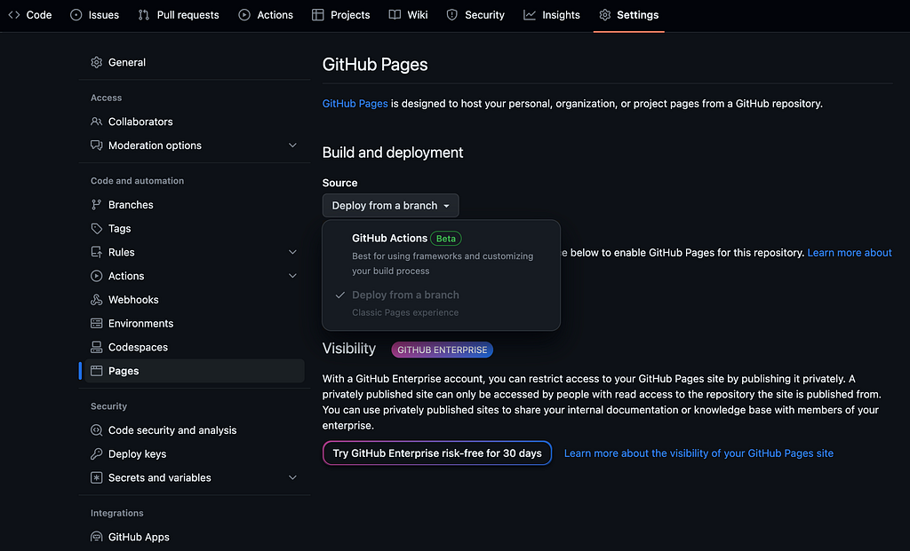
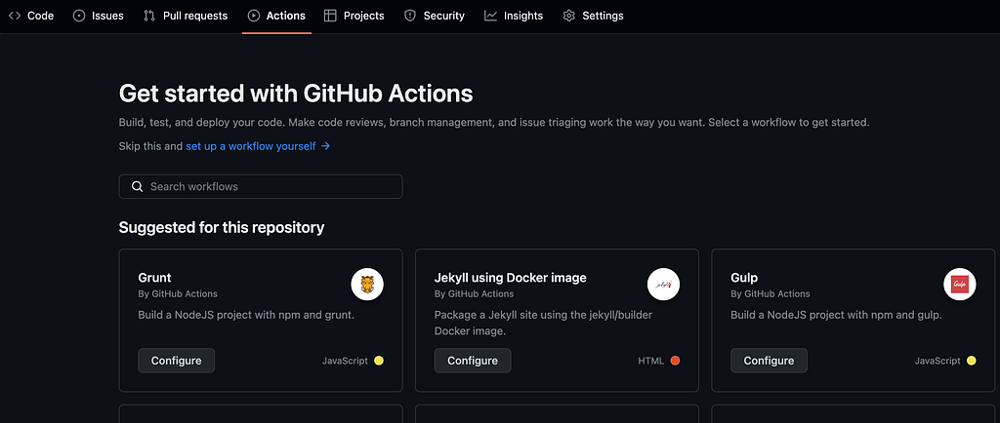
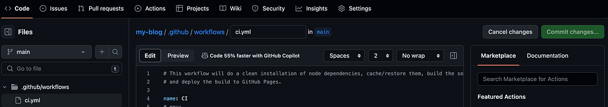

You can use **GitHub Pages** to host your website / web application. If your application needs a build process to generate the static files, you can use **GitHub Actions Workflow** to automate the whole process of building and deploying to GitHub Pages.

Once you have automated the process, each time a commit is pushed from local to the GitHub repo, the workflow will be triggered and the website / web app will be updated automatically.

First, you need to add your codebase to a GitHub repository if you haven’t done already. If you are using the **GitHub free version**, your repository needs to be **public** in order to use GitHub Pages.

### Publishing static content to GitHub Pages

If your codebase does not need a build process to generate the static content (in other words, if your codebase includes the static files itself), you can simply follow below steps to publish your website.



_GitHub Settings_

1. Go to your GitHub repository (make sure the repo is public, if you are using GitHub Free version)
2. Go to the **Settings** tab. Select the **Pages** tab under the **Code and automation** section in the sidebar.
3. Select the **Deploy from a branch** option from the **Source** dropdown.
4. Select your branch and the source folder and save.
5. Your website will be deployed within a few minutes and you can refresh your current page (if not automatically updated) and view the **View site** link. The site link will be in the format of **https://&lt;github-username>.github.io/&lt;repo-name>/**
6. Now try pushing a new code change to the repo. You’ll see the website is updated within a few minutes with your latest changes.

If you need any customisation or additional steps, you can use GitHub Actions to create a workflow.

### GitHub Actions and Workflows

You can use **GitHub Actions** to create **workflows** to automate the processes such as **CI / CD**. You can implement the workflow with CI / CD to host your application in Azure / AWS etc if you need to. In this article, we’ll deploy the application to **GitHub Pages**.

You can use a workflow to build, test and deploy a **React application**. If you’re using a **static site generator** such as MkDocs, the process will be similar, but you’ll have to update the workflow to meet your requirements.

### Publishing a React application to GitHub Pages

1. Go to your GitHub repository (make sure the repo is public, if you are using GitHub Free version)
2. Go to the **Settings** tab. Select the **Pages** tab under the **Code and automation** section in the sidebar.
3. Select the **GitHub Actions** option from the **Source** dropdown.
4. Go to the **Actions** tab **or** click on the **browse all workflows** link that appear below the Source dropdown. There’s a list of predefined workflows which you can configure based on the technologies you use. You can choose to setup a workflow by yourself as well.



_GitHub Actions_

Following is a workflow that can be used to build, test and deploy a React application to GitHub pages. This workflow will be triggered each time a commit is pushed / a PR is created to the main branch.

```yaml
name: CI

on:
  push:
    branches: [ "main" ]
  pull_request:
    branches: [ "main" ]

env:
  CI: false

jobs:
  build:

    runs-on: ubuntu-latest
    environment:
      name: github-pages
      url: ${{ steps.deployment.outputs.page_url }}
    
    permissions:
      contents: 'read'
      id-token: 'write'
      pages: 'write'
      actions: 'write'
      checks: 'write'
      deployments: 'write'
    strategy:
      matrix:
        node-version: [18.x]
        # See supported Node.js release schedule at https://nodejs.org/en/about/releases/

    steps:
    - uses: actions/checkout@v3
    - name: Use Node.js ${{ matrix.node-version }}
      uses: actions/setup-node@v3
      with:
        node-version: ${{ matrix.node-version }}
        cache: 'npm'
    - name: Install dependencies
      # Using npm ci is generally faster than running npm i because it caches dependencies
      run: |
        npm ci
    - name: Build the app
      run: |
        npm run build
    - name: Run component tests
      run: |
        npm run test
        
    - name: Setup Pages
      uses: actions/configure-pages@v3
    - name: Upload artifact
      uses: actions/upload-pages-artifact@v1
      with:
        # Upload build directory content
        path: 'build/'
    - name: Deploy to GitHub Pages
      id: deployment
      uses: actions/deploy-pages@v1
      env:  
        GITHUB_TOKEN: ${{ secrets.GITHUB_TOKEN }}
```

We have used predefined **actions** here in this workflow. They are in the format of **_actions/&lt;action_name>@&lt;version>_** in the above workflow. You can view more details about these actions by visiting to [GitHub Marketplace](https://github.com/marketplace?type=actions).

After adding the workflow, commit the changes to the main branch.



_Workflow yaml file_

If you go to **Actions** tab now, you can see the workflow is running.

But there’s one more thing you need to do in order to successfully host your React application. You have to update your **package.json** file with the **homepage** set to the **base url of the application** as shown below (update the value of **github-username** and **repo-name** with yours). This is because, the create-react-app uses the **homepage** field to determine the root URL when building the application.

```json
{
  "name": "my-portfolio",
  "version": "0.1.0",
  "private": true,
  "homepage": "https://<github-username>.github.io/<repo-name>/",
  "dependencies": {
```

Now commit and push the above change to your repo (you’ll have to pull the changes to your local first). A new workflow will be triggered and you can view its status and flow in the **Actions** tab.

Once it is successfully completed, you can go this link and view your published application. **https://&lt;github-username>.github.io/&lt;repo-name>/.** You can find the link in the **Actions** page or in **Settings** page **-> Pages** tab also.

But, if you’re using **client-side routing** in your **React application** (using **react-router-dom**), then the routing will not work as expected. The reason is, GitHub server doesn’t know such a path exists since it’s only a client-side routing. Therefore it’ll show a 404 page.

As a workaround for this, you can use [**HashRouter**](https://reactrouter.com/en/main/router-components/hash-router) from **react-router-dom** to wrap your routes instead of using BrowserRouter. This adds the route to the **# portion** in your url, instead of sending it to the server.

Now your application should be successfully published to GitHub Pages! Since the CI / CD pipeline is also implemented using the workflow, each time you push a commit / create a PR to main branch, your application will be built, tested and deployed.

### Conclusion

- If your codebase already consists of static files, you can simply configure the repo to publish the website to GitHub Pages and deploy each time a change is added.
- If you need a build process such as in the case of static site generators or React applications, you can create GitHub Actions Workflow to automate the CI / CD process.
- If you’re hosting a React application and uses client-side routing, you’ll have to do some changes in the codebase to make it work properly.

Follow me and stay tuned! If you have any questions, let me know in the comments!
