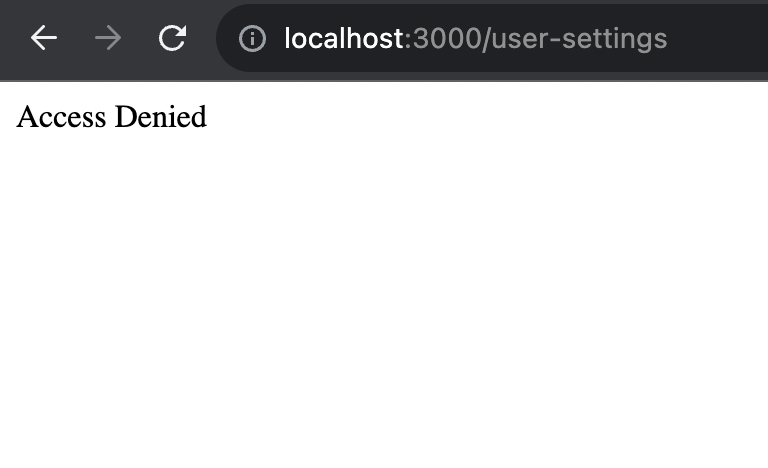

We can use **Role Based Access Control (RBAC)** when we need to **restrict** the users from accessing pages / backend APIs, based on their **role** (permission level). For this tutorial, you need to have an application which already handles user authentication using **token-based authentication**. This way, we’ll have a **JWT token** we can use to include and retrieve user roles.

If you don’t have an application to continue this tutorial, you can view my previous articles and create an application which uses **React**, **TypeScript**, **Redux Toolkit**, **React Router V6** for the [frontend](/blog/redux-toolkit-state-management/), and **Express**, **TypeScript**, **MongoDB** for [backend and databases](/blog/express-typescript-authentication/).

For this tutorial, we’ll have 4 roles; _Admin_, _Lead_, _Project Manager_ and _User_.

## 1. Authorization for Express backend

Create a **constants.ts** file under the **src** folder in your backend application and include below.

```ts
export enum Roles {
  Admin = "ADMIN",
  Lead = "LEAD",
  ProjectManager = "PROJECT_MANAGER",
  User = "USER",
}
```

Then we’ll update the **User model** with our new field; **roles** which will be an **array** in case a user has **multiple** roles. We’ll add the **default role** as **USER**, so that when a user **registers**, he’ll be assigned with **USER** role by default. (If the user role needs to be updated, that has to be done by an admin from a separate Settings page.) The **User.ts** file will be as below.

```tsx
import mongoose, { Document, Schema } from "mongoose";
import bcrypt from "bcryptjs";
import { Roles } from "../constants";

export interface IUser extends Document {
  name: string;
  email: string;
  password: string;
  roles: string[];
  comparePassword: (enteredPassword: string) => boolean;
}

const userSchema = new Schema<IUser>({
  name: {
    type: String,
    required: true,
  },
  email: {
    type: String,
    required: true,
    unique: true,
  },
  password: {
    type: String,
    required: true,
  },
  roles: {
    type: [String],
    required: true,
    default: [Roles.User],
  },
});

userSchema.pre("save", async function (next) {
  if (!this.isModified("password")) {
    next();
  }

  const salt = await bcrypt.genSalt(10);
  this.password = await bcrypt.hash(this.password, salt);
});

userSchema.methods.comparePassword = async function (enteredPassword: string) {
  return await bcrypt.compare(enteredPassword, this.password);
};

const User = mongoose.model("User", userSchema);

export default User;
```

In the last tutorial, we defined the **Request** interface to include **user** information as well, let’s include **roles** to the list. Update the interface as below in the **index.ts** file.

```ts
interface UserBasicInfo {
  _id: string;
  email: string;
  roles: string[];
}

declare global {
  namespace Express {
    interface Request {
      user?: UserBasicInfo | null;
    }
  }
}
```

Currently, when a user tries to register / login, the user is created / user credentials are validated, and once it’s successful, we **generate a JWT token** and **sends user data in the response body**.

For the **JWT token payload**, we need to include user **roles** as well. Then, when a user sends a request to access a **restricted** resource, we can **decode the token** and retrieve the user roles and then decide whether we allow them to access / not.

For the **response body** we send back in login / register, we can include the user **roles** as well, so that we can restrict the page access or actions in the **frontend application** based on that.

Let’s update the **userController.ts** file as below.

```ts
import { Request, Response } from "express";
import User from "../models/User";
import { generateToken, clearToken } from "../utils/auth";
import {
  BadRequestError,
  AuthenticationError,
} from "../middleware/errorMiddleware";
import asyncHandler from "express-async-handler";

const registerUser = asyncHandler(async (req: Request, res: Response) => {
  const { name, email, password } = req.body;
  const userExists = await User.findOne({ email });

  if (userExists) {
    res.status(409).json({ message: "The email already exists" });
  }

  const user = await User.create({
    name,
    email,
    password,
  });

  if (user) {
    generateToken(res, {
      userId: user._id,
      userEmail: user.email,
      roles: user.roles,
    });
    res.status(201).json({
      id: user._id,
      name: user.name,
      email: user.email,
      roles: user.roles,
    });
  } else {
    throw new BadRequestError("An error occurred in registering the user");
  }
});

const authenticateUser = asyncHandler(async (req: Request, res: Response) => {
  const { email, password } = req.body;
  const user = await User.findOne({ email });

  if (user && (await user.comparePassword(password))) {
    generateToken(res, {
      userId: user._id,
      userEmail: user.email,
      roles: user.roles,
    });
    res.status(201).json({
      id: user._id,
      name: user.name,
      email: user.email,
      roles: user.roles,
    });
  } else {
    throw new AuthenticationError("User not found / password incorrect");
  }
});

const logoutUser = asyncHandler(async (req: Request, res: Response) => {
  clearToken(res);
  res.status(200).json({ message: "Successfully logged out" });
});

export { registerUser, authenticateUser, logoutUser };
```

Our **generateToken()** function also needs to be updated to include the new **payload** we’re sending.

```ts
import jwt from "jsonwebtoken";
import { Response } from "express";

interface TokenPayload {
  userId: string;
  userEmail: string;
  roles: string[];
}

const generateToken = (res: Response, payload: TokenPayload) => {
  const jwtSecret = process.env.JWT_SECRET || "";
  const token = jwt.sign(payload, jwtSecret, {
    expiresIn: "1h",
  });

  res.cookie("jwt", token, {
    httpOnly: true,
    secure: process.env.NODE_ENV !== "development",
    sameSite: "strict",
    maxAge: 60 * 60 * 1000,
  });
};

const clearToken = (res: Response) => {
  res.cookie("jwt", "", {
    httpOnly: true,
    expires: new Date(0),
  });
};

export { generateToken, clearToken };
```

When a user tries to access a **restricted** resource (_users/:id_ to view profile information), we already use a **middleware** to verify **user authentication**. In this middleware, we attach user info to the **request** object, so that we can access them in controllers/ other middleware. I was retriving the user data from database, let’s use the data we **decode from the token** instead.

```ts
const authenticate = (req: Request, res: Response, next: NextFunction) => {
  try {
    let token = req.cookies.jwt;

    if (!token) {
      throw new AuthenticationError("Token not found");
    }

    const jwtSecret = process.env.JWT_SECRET || "";
    const decoded = jwt.verify(token, jwtSecret) as JwtPayload;

    if (!decoded || !decoded.userId || !decoded.userEmail) {
      throw new AuthenticationError("User not found");
    }

    const { userId, userEmail, roles } = decoded;

    req.user = { _id: userId, email: userEmail, roles };
    next();
  } catch (e) {
    throw new AuthenticationError("Invalid token");
  }
};
```

Now we need a **middleware** to **authorize** the user, to check if he can access the resource. Now, different routes have different access levels, **eg:** some should only be accessible for Admin roles, where in other cases, either Admin or User roles can access the routes. Therefore we can write a common middleware as below.

```ts
const authorize = (allowedRoles: string[]) => {
  return (req: Request, res: Response, next: NextFunction) => {
    const userRoles = req.user?.roles;

    if (
      !userRoles ||
      !userRoles.some((role: string) => allowedRoles.includes(role))
    ) {
      return res.status(403).json({ message: "Access denied" });
    }

    next();
  };
};
```

If there are no user roles **or** if the user roles doesn’t have any of the allowed roles, we’ll return a **403**.

In order to demonstrate our feature, let’s create another route as **_/users_** where we’re retrieving a list of all the users. It should only be accessible by the **Admin**. Update the **userController.ts** file as below.

```ts
import { Request, Response } from "express";
import User from "../models/User";
import { BadRequestError } from "../middleware/errorMiddleware";
import asyncHandler from "express-async-handler";

const getUser = asyncHandler(async (req: Request, res: Response) => {
  const userId = req.user?._id;
  const user = await User.findById(userId, "name email");

  if (!user) {
    throw new BadRequestError("User not available");
  }

  res.status(200).json(user);
});

const getUsers = asyncHandler(async (req: Request, res: Response) => {
  const users = await User.find({}, "name email");

  res.status(200).json(
    users.map((user) => {
      return { id: user._id, name: user.name, email: user.email };
    })
  );
});

export { getUser, getUsers };
```

Now we can update our routes to use the **authorize** middleware we created. Update the **userRouter.ts** as below.

```ts
import express from "express";
import { getUser, getUsers } from "../controllers/userController";
import { authorize } from "../middleware/authMiddleware";
import { Roles } from "../constants";

const router = express.Router();

router.get(
  "/:id",
  authorize([Roles.User, Roles.ProjectManager, Roles.Lead, Roles.Admin]),
  getUser
);

router.get("/", authorize([Roles.Admin]), getUsers);

export default router;
```

That’s it for the backend. Let’s move to frontend.

## 2. Authorization for React application

We’ll update our frontend routes / page access based on the user roles. Note that **frontend restriction “only” is not enough**, we **must** protect our routes from the **backend** as above.

We’re using **Redux Toolkit** to manage our app state. Let’s update our **authSlice.ts** **UserBasicInfo type** (the info we use to validate user) to save the **roles** we now receive from the backend.

```ts
type UserBasicInfo = {
  id: string;
  name: string;
  email: string;
  roles: string[];
};
```

Let’s include the list of **Roles** to the **constants.ts** file. I have included **ErrorResponse** type as well to the file, since we use it everywhere.

```ts
export type ErrorResponse = {
  message: string;
};

export enum Roles {
  Admin = "ADMIN",
  Lead = "LEAD",
  ProjectManager = "PROJECT_MANAGER",
  User = "USER",
}
```

Since I need to demonstrate the feature we’re implementing, I’ll create another page as **UserSettings.tsx**, where only **Admins** should have access to. We’re retrieving the list of all users and show them in the page. First, let’s create the **userSlice.ts** to handle the state.

```tsx
import { PayloadAction, createAsyncThunk, createSlice } from "@reduxjs/toolkit";
import axiosInstance from "../api/axiosInstance";
import { AxiosError } from "axios";
import { ErrorResponse } from "../constants";

type UserInfo = {
  id: string;
  name: string;
  email: string;
  roles: string[];
};

type UserApiState = {
  users: UserInfo[];
  status: "idle" | "loading" | "failed";
  error: string | null;
};

const initialState: UserApiState = {
  users: [],
  status: "idle",
  error: null,
};

export const getUsers = createAsyncThunk(
  "users/getAll",
  async (_, { rejectWithValue }) => {
    try {
      const response = await axiosInstance.get("/users");
      return response.data;
    } catch (error) {
      if (error instanceof AxiosError && error.response) {
        const errorResponse = error.response.data;

        return rejectWithValue(errorResponse);
      }

      throw error;
    }
  }
);

const userSlice = createSlice({
  name: "user",
  initialState,
  reducers: {},
  extraReducers: (builder) => {
    builder
      .addCase(getUsers.pending, (state) => {
        state.status = "loading";
        state.error = null;
      })
      .addCase(
        getUsers.fulfilled,
        (state, action: PayloadAction<UserInfo[]>) => {
          state.status = "idle";
          state.users = action.payload;
        }
      )
      .addCase(getUsers.rejected, (state, action) => {
        state.status = "failed";
        if (action.payload) {
          state.error =
            (action.payload as ErrorResponse).message ||
            "Retrieving users failed";
        } else {
          state.error = action.error.message || "Retrieving users failed";
        }
      });
  },
});

export default userSlice.reducer;
```

Add the slice reducer to the **store.ts** file.

```tsx
import { configureStore } from "@reduxjs/toolkit";
import authReducer from "./slices/authSlice";
import userReducer from "./slices/userSlice";
import notificationReducer from "./slices/notificationSlice";
import { axiosMiddleware } from "./api/middleware";

const store = configureStore({
  reducer: {
    auth: authReducer,
    users: userReducer,
    notification: notificationReducer,
  },
  middleware: (getDefaultMiddleware) =>
    getDefaultMiddleware().concat(axiosMiddleware),
});

export type RootState = ReturnType<typeof store.getState>;
export type AppDispatch = typeof store.dispatch;

export default store;
```

Under the **pages** folder, create following files.

**UserSettings.tsx** as a Admin-only access page

```tsx
import React, { useEffect } from "react";
import { useAppDispatch, useAppSelector } from "../hooks/redux-hooks";
import { getUsers } from "../slices/userSlice";

const UserSettings = () => {
  const dispatch = useAppDispatch();
  const users = useAppSelector((state) => state.users.users);

  useEffect(() => {
    dispatch(getUsers());
  }, []);

  return (
    <>
      <h1>User Settings</h1>
      {users.map((user) => (
        <div>
          <h4>User Email: </h4>
          {user.name}
        </div>
      ))}
    </>
  );
};

export default UserSettings;
```

**AccessDenied.tsx** file to render if the user tries to access a page he doesn’t have access to.

```tsx
import React from "react";

const AccessDenied = () => {
  return <div>Access Denied</div>;
};

export default AccessDenied;
```

**NotFound.tsx** file since we don’t have a page yet to show, in case the user tries to enter a route that **doesn’t exist**. (not related to authorization)

```tsx
import React from "react";

const NotFound = () => {
  return <div>Not Found</div>;
};

export default NotFound;
```

Our **App.tsx** file is as below for the moment.

```tsx
import React from "react";
import { Routes, Route } from "react-router-dom";
import Home from "./pages/Home";
import Login from "./pages/Login";
import Register from "./pages/Register";
import DefaultLayout from "./layouts/DefaultLayout";
import ProtectedLayout from "./layouts/ProtectedLayout";
import NotificationBar from "./components/notification/NotificationBar";

function App() {
  return (
    <>
      <NotificationBar />
      <Routes>
        <Route element={<DefaultLayout />}>
          <Route path="/login" element={<Login />} />
          <Route path="/register" element={<Register />} />
        </Route>
        <Route element={<ProtectedLayout />}>
          <Route path="/" element={<Home />} />
        </Route>
      </Routes>
    </>
  );
}

export default App;
```

All the **protected routes** should be wrapped in a route with **ProtectedLayout** as the layout. Therefore we can handle the access control inside the **ProtectedLayout** component. Update the **ProtectedLayout.tsx** as below.

```tsx
import React from "react";
import { Link, Outlet } from "react-router-dom";
import { useAppDispatch, useAppSelector } from "../hooks/redux-hooks";
import { Navigate } from "react-router-dom";
import AccessDenied from "../pages/AccessDenied";

type ProtectedLayoutType = {
  allowedRoles: string[];
};

const ProtectedLayout = ({ allowedRoles }: ProtectedLayoutType) => {
  const basicUserInfo = useAppSelector((state) => state.auth.basicUserInfo);

  if (!basicUserInfo) {
    return <Navigate replace to={"/login"} />;
  }

  if (
    !basicUserInfo.roles ||
    !basicUserInfo.roles.some((role: string) => allowedRoles.includes(role))
  ) {
    return <AccessDenied />;
  }

  return (
    <>
      <Outlet />
    </>
  );
};

export default ProtectedLayout;
```

Now let’s update our **App.tsx** as below, defining **allowed roles** for each of the protected route.

```tsx
import React from "react";
import { Routes, Route } from "react-router-dom";
import Home from "./pages/Home";
import Login from "./pages/Login";
import Register from "./pages/Register";
import UserSettings from "./pages/UserSettings";
import NotFound from "./pages/NotFound";
import DefaultLayout from "./layouts/DefaultLayout";
import ProtectedLayout from "./layouts/ProtectedLayout";
import NotificationBar from "./components/notification/NotificationBar";
import { Roles } from "./constants";

function App() {
  return (
    <>
      <NotificationBar />
      <Routes>
        <Route element={<DefaultLayout />}>
          <Route path="/login" element={<Login />} />
          <Route path="/register" element={<Register />} />
        </Route>
        <Route
          element={
            <ProtectedLayout
              allowedRoles={[
                Roles.User,
                Roles.ProjectManager,
                Roles.Lead,
                Roles.Admin,
              ]}
            />
          }
        >
          <Route path="/" element={<Home />} />
        </Route>
        <Route element={<ProtectedLayout allowedRoles={[Roles.Admin]} />}>
          <Route path="/user-settings" element={<UserSettings />} />
        </Route>
        <Route path="*" element={<NotFound />} />
      </Routes>
    </>
  );
}

export default App;
```

That’s it for the access control for the frontend application.

In order to test the application, you’ll have to logout first, if you were logged in. Else, you can clear the local storage and try to login / register.

If you already have a user, login still works even though he **doesn’t have any roles saved** for his record in the database. This is since, **Mongoose** assign **default** value we set for the **roles**, if the user doesn’t have any in the database level. Therefore login should work.

If you try to **register** a new user, his roles will be saved to the database as [“USER”] by **default**.

You should be able to visit the homepage (**_“/”_**) since it’s allowed for **all roles**. Now, if you type **_/user-settings_** in the address bar url, you’ll only see **AccessDenied** page, since you don’t have **ADMIN role**.



_Access Denied for users with no required roles_

You can check if all the features are working by changing access levels in frontend and backend to handle different cases. You **must** verify that, even if a request to retrieve user list is initiated in the application, it is failed with a **403 status code**, if you **don’t** have the required roles.

Visit [frontend codebase](https://github.com/Prabashi/project-mgt-app-frontend/tree/auth-rbac) and [backend codebase](https://github.com/Prabashi/project-mgt-app-backend/tree/auth-rbac) to view the full implementation up to now.

Follow me and stay tuned! If you have any questions, let me know in the comments!

### Previous Steps

Create a React application with Login / Register pages

[Create a simple React app (TypeScript) with Login / Register pages using create-react-app](/blog/react-typescript-login-register/)

Manage your React application state using Redux Toolkit

[Manage your React (TypeScript) application state using Redux Toolkit](/blog/redux-toolkit-state-management/)

Manage notifications in your React application

[Handle notifications in your React application (TypeScript) using Redux toolkit and use a custom…](/blog/react-notifications-redux-middleware/)

Create an Express backend application to handle authentication

[Create a backend application using Express (TypeScript) and handle authentication](/blog/express-typescript-authentication/)
