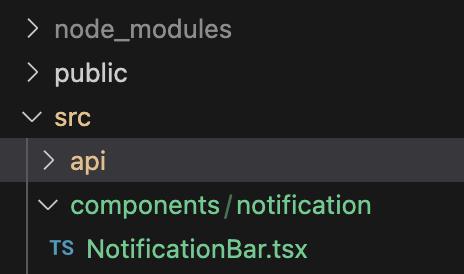
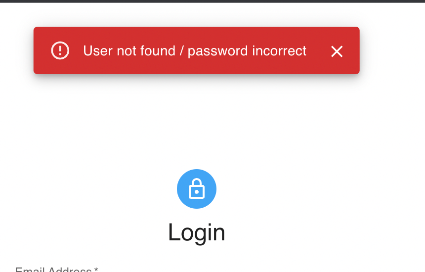

If you’re following the [series](/blog/redux-toolkit-state-management/), you already have a **React** application and a **Express** backend which handles **authentication**. But, we still haven’t implemented a method to show the users **any error / success messages** in the application.

Here we’re going to implement showing notifications for **frontend validation errors** as well as **API response errors.** You’ll need a frontend application which uses Redux Toolkit to handle the state, with / without APIs. Refer [this](/blog/react-typescript-login-register/) if you need a start. Let’s start!

We’re using **redux-toolkit** to manage the state of the notifications; to handle if it is **open**, the **message** it shows and the **type** of the message. Assuming you have already setup redux, create a **notificationSlice.ts** under **slices** folder and add below code. We’re creating two **reducers** to handle the show / hide notifications.

```tsx
import { PayloadAction, createSlice } from "@reduxjs/toolkit";

export enum NotificationType {
  Success = "success",
  Error = "error",
  Warning = "warning",
  Info = "info",
}

type Notification = {
  open: boolean;
  message: string;
  type: NotificationType;
};

type ShowNotification = Omit<Notification, "open">;

const initialState = {
  open: false,
  message: "",
  type: NotificationType.Success,
};

const notificationSlice = createSlice({
  name: "notification",
  initialState,
  reducers: {
    showNotification: (state, action: PayloadAction<ShowNotification>) => {
      state.open = true;
      state.message = action.payload.message;
      state.type = action.payload.type;
    },
    hideNotification: (state) => {
      state.open = false;
      state.message = "";
    },
  },
});

export const { showNotification, hideNotification } = notificationSlice.actions;
export default notificationSlice.reducer;
```

We need to add this to the **store** as well.

```ts
// Other imports here
import notificationReducer from "./slices/notificationSlice";

const store = configureStore({
  reducer: {
    auth: authReducer,
    user: userReducer,
    notification: notificationReducer,
  },
});

// Rest of the code here
```

Let’s create the notification bar component. Create a **components** folder under **src**, then a **notification** folder, and then **NotificationBar.tsx** as below.



_Folder / file structure for components_

I’m using **MUI Snackbar** for this and below is an updated version of one of their examples.

```tsx
import * as React from "react";
import Stack from "@mui/material/Stack";
import Snackbar from "@mui/material/Snackbar";
import MuiAlert, { AlertProps } from "@mui/material/Alert";
import { useAppSelector } from "../../hooks/redux-hooks";
import { hideNotification } from "../../slices/notificationSlice";
import { useAppDispatch } from "../../hooks/redux-hooks";

const Alert = React.forwardRef<HTMLDivElement, AlertProps>(function Alert(
  props,
  ref
) {
  return <MuiAlert elevation={6} ref={ref} variant="filled" {...props} />;
});

const NotificationBar = () => {
  const dispatch = useAppDispatch();
  const { open, message, type } = useAppSelector((state) => state.notification);

  const handleClose = (
    event?: React.SyntheticEvent | Event,
    reason?: string
  ) => {
    if (reason === "clickaway") {
      return;
    }

    dispatch(hideNotification());
  };

  return (
    <Stack spacing={2} sx={{ width: "100%" }}>
      <Snackbar
        open={open}
        autoHideDuration={6000}
        onClose={handleClose}
        anchorOrigin={{ vertical: "top", horizontal: "center" }}
      >
        <Alert onClose={handleClose} severity={type} sx={{ width: "100%" }}>
          {message}
        </Alert>
      </Snackbar>
    </Stack>
  );
};

export default NotificationBar;
```

Here we retrieve **open**, **message** and **type** of **notification state** and use them in our JSX to handle the status (open / not), message and type of the notification. We also dispatch **hideNotification()** action in **handleClose()** function, so that if the user clicks on the close icon in the notification, the notification is **closed**. If we don’t close it, it **automatically** calls **onClose()** function after **autoHideDuration** (6000 milli seconds).

Since we’re showing only **one notification at a time**, and since we’re using this **globally** (in every page), we can add this component to our **App.tsx** file.

```tsx
// Other imports here
import NotificationBar from "./components/notification/NotificationBar";

function App() {
  return (
    <>
      <NotificationBar />
      <Routes>
        {/* Routes here */}
      </Routes>
    </>
  );
}

export default App;
```

Now let’s move into the usages of this notification bar. One usage is **showing validation errors in login and register pages**. Currently our Login page **handleLogin()** function looks like below.

```ts
const handleLogin = async () => {
    // This is only a basic validation of inputs. Improve this as needed.
    if (email && password) {
      try {
        await dispatch(
          login({
            email,
            password,
          })
        ).unwrap();
      } catch (e) {
        console.error(e);
      }
    } else {
      // Show an error message.
    }
};
```

Let’s show an error notification if email / password is not provided (in **_else_** block).

```ts
import {
  showNotification,
  NotificationType,
} from "../slices/notificationSlice";

const handleLogin = async () => {
    // This is only a basic validation of inputs. Improve this as needed.
    if (email && password) {
      try {
        await dispatch(
          login({
            email,
            password,
          })
        ).unwrap();
      } catch (e) {
        console.error(e);
      }
    } else {
      dispatch(
        showNotification({
          message: "Please provide email and password",
          type: NotificationType.Error,
        })
      );
    }
};
```

Now you can check if this works in the hosted application. You can do the same for the registration page as well.

```ts
import {
  showNotification,
  NotificationType,
} from "../slices/notificationSlice";

const handleRegister = async () => {
    // This is only a basic validation of inputs. Improve this as needed.
    if (name && email && password) {
      try {
        await dispatch(
          register({
            name,
            email,
            password,
          })
        ).unwrap();
      } catch (e) {
        console.error(e);
      }
    } else {
      dispatch(
        showNotification({
          message: "Please fill out all the required fields",
          type: NotificationType.Error,
        })
      );
    }
};
```

Now we can move into **handling API response failures**. You’ll have to refer to the [previous article](/blog/redux-toolkit-state-management/) for this part, **or** if you already handle API requests using Redux Toolkit features, it’ll be fine too.

Currently, we don’t do any error handling inside the **thunk action creators** where we initiate the requests (login, register, logout, getUser). We only set the **error** to our **state** in the **extra reducers** and that’s it.

But inside the **components** where we dispatch those actions, we call **unwrap()** to retrieve any errors occurred and use a **try-catch block** to handle it in the **component level**. Here, we can dispatch the **showNotification** action inside the catch block. This is a good approach **if you need to handle errors in the component level**. But when the application grows, this might be difficult to handle.

We can handle the errors in a more generalized way, where we initiate the requests. That way, we can handle the responses in a more centralized way (we don’t need to handle errors in component level). Also, I’m hoping to send **meaningful error messages from the backend** for known failures, therefore I need to **show them as it is** to the user. This is what we’re going to do here. We’ll show notifications for both success and error scenarios.

This is what our **login** action creator in **authSlice.ts** looked earlier,

```ts
export const login = createAsyncThunk("login", async (data: User) => {
  const response = await axiosInstance.post(`${BACKEND_BASE_URL}/login`, data);
  const resData = response.data;

  localStorage.setItem("userInfo", JSON.stringify(resData));

  return resData;
});
```

Let’s update it as follows.

```ts
import { AxiosError } from "axios";
import { showNotification, NotificationType } from "./notificationSlice";
// Rest of the code here

export const login = createAsyncThunk(
  "login",
  async (data: User, { rejectWithValue, dispatch }) => {
    try {
      const response = await axiosInstance.post("/login", data);
      const resData = response.data;

      localStorage.setItem("userInfo", JSON.stringify(resData));
      dispatch(
        showNotification({
          message: resData.message || "Success",
          type: NotificationType.Success,
        })
      );

      return resData;
    } catch (error) {
      if (error instanceof AxiosError && error.response) {
        const errorResponse = error.response.data;
        dispatch(
          showNotification({
            message: errorResponse.message,
            type: NotificationType.Error,
          })
        );
        return rejectWithValue(errorResponse);
      }
      dispatch(
        showNotification({
          message: "An error occurred",
          type: NotificationType.Error,
        })
      );

      throw error;
    }
  }
);
```

As you can see, we try the request in **try block**, and it it’s a success, we **dispatch showNotification** action to show a **success** message. If there’s an **error**, we catch it in the **catch block**.

When we receive a failed response, it can be either a one **we handled in the backend**, **or** it can be **some other error** such as a connection failure. Since we know the format of the error responses **we return**, we can check for them using a **if block** as above. If it is a error response **we sent**, we show the message sent from the backend. Otherwise, we show a **general error** (“An error occurred”).

When returning / throwing the error, **if we have an error message we sent from the backend**, I need to pass that to the **rejected** action (there’s no usecase for this for the moment). If we just **throw the error** received from **catch block,** we **can’t extract** those information. For that, we can use **rejectWithValue()** from redux-toolkit, it’s a function we can use to return an error response with a **defined payload**. Whatever payload we pass to this function, we can access in the **payload** of the **rejected action**. We can do something like below in **login** **rejected** case.

```ts
// Define type at the top
type ErrorResponse = {
  message: string;
};

// Rest of the code here

.addCase(login.rejected, (state, action) => {
  state.status = "failed";

  if (action.payload) {
    state.error = (action.payload as ErrorResponse).message || "Login failed";
  } else {
    state.error = action.error.message || "Login failed";
  }
})
```

Now, you can do the changes we did to **login()** earlier, to all the other thunk action creators (register, logout, getUser). But as you can see, this results in **code duplication**, and when our application grows, it’ll be difficult to handle this in every case.

One of the **simple** solutions for this is, creating a **custom middleware** for the **redux store**. When we use this middleware, every action will call this middleware and if the conditions match, it will perform any actions we need to dispatch. Adding custom middleware causes **additional overhead**, but since this is a simple one, we can go ahead with this solution.

I included the middleware file inside the **api** folder, but it is up to you. Create a **middleware.ts** file and include the following.

```ts
import { Middleware } from "@reduxjs/toolkit";
import {
  showNotification,
  NotificationType,
} from "../slices/notificationSlice";

export const axiosMiddleware: Middleware =
  ({ dispatch }) =>
  (next) =>
  async (action) => {
    if (action.type.endsWith("/rejected")) {
      const errorMessage = action.payload?.message || "An error occurred!";

      dispatch(
        showNotification({
          type: NotificationType.Error,
          message: errorMessage,
        })
      );
    } else if (action.type.endsWith("/fulfilled")) {
      const successMessage = action.payload?.message || "Sucess!";

      dispatch(
        showNotification({
          type: NotificationType.Success,
          message: successMessage,
        })
      );
    }

    return next(action);
  };
```

If the **action type** ends with **_/rejected_**, meaning the request is **failed**, we retrieve the error message **if any**, and show error notification. If the request was successful (**_/fulfilled_**), then we show a success notification. This middleware centralizes the notification handling for the API request responses. We need to tell the **store** to use this **middleware** as below.

```ts
import { axiosMiddleware } from "./api/middleware";
// Rest of the imports here

const store = configureStore({
  reducer: {
    auth: authReducer,
    user: userReducer,
    notification: notificationReducer,
  },
  middleware: (getDefaultMiddleware) =>
    getDefaultMiddleware().concat(axiosMiddleware),
});

// Rest of the code here
```

Now, we **don’t need** all the handling we did in the **login()** action creator. But we still need to **pass the payload** we receive from the error response, to the middleware (note the **rejectWithValue()** in **catch** block). Update **login()** as below.

```ts
export const login = createAsyncThunk(
  "login",
  async (data: User, { rejectWithValue }) => {
    try {
      const response = await axiosInstance.post("/login", data);
      const resData = response.data;

      localStorage.setItem("userInfo", JSON.stringify(resData));

      return resData;
    } catch (error) {
      if (error instanceof AxiosError && error.response) {
        const errorResponse = error.response.data;

        return rejectWithValue(errorResponse);
      }

      throw error;
    }
  }
);
```

You can update other ones in the same manner. Below is the final code for the **authSlice.ts**. We don’t actually use error state we set inside the extra reducers, but I’m keep it as this for the moment.

```tsx
import { createSlice, createAsyncThunk, PayloadAction } from "@reduxjs/toolkit";
import axiosInstance from "../api/axiosInstance";
import { AxiosError } from "axios";

type User = {
  email: string;
  password: string;
};

type NewUser = User & {
  name: string;
};

type UserBasicInfo = {
  id: string;
  name: string;
  email: string;
};

type UserProfileData = {
  name: string;
  email: string;
};

type ErrorResponse = {
  message: string;
};

type AuthApiState = {
  basicUserInfo?: UserBasicInfo | null;
  userProfileData?: UserProfileData | null;
  status: "idle" | "loading" | "failed";
  error: string | null;
};

const initialState: AuthApiState = {
  basicUserInfo: localStorage.getItem("userInfo")
    ? JSON.parse(localStorage.getItem("userInfo") as string)
    : null,
  userProfileData: undefined,
  status: "idle",
  error: null,
};

export const login = createAsyncThunk(
  "login",
  async (data: User, { rejectWithValue }) => {
    try {
      const response = await axiosInstance.post("/login", data);
      const resData = response.data;

      localStorage.setItem("userInfo", JSON.stringify(resData));

      return resData;
    } catch (error) {
      if (error instanceof AxiosError && error.response) {
        const errorResponse = error.response.data;

        return rejectWithValue(errorResponse);
      }

      throw error;
    }
  }
);

export const register = createAsyncThunk(
  "register",
  async (data: NewUser, { rejectWithValue }) => {
    try {
      const response = await axiosInstance.post("/register", data);
      const resData = response.data;

      localStorage.setItem("userInfo", JSON.stringify(resData));

      return resData;
    } catch (error) {
      if (error instanceof AxiosError && error.response) {
        const errorResponse = error.response.data;

        return rejectWithValue(errorResponse);
      }

      throw error;
    }
  }
);

export const logout = createAsyncThunk(
  "logout",
  async (_, { rejectWithValue }) => {
    try {
      const response = await axiosInstance.post("/logout", {});
      const resData = response.data;

      localStorage.removeItem("userInfo");

      return resData;
    } catch (error) {
      if (error instanceof AxiosError && error.response) {
        const errorResponse = error.response.data;

        return rejectWithValue(errorResponse);
      }

      throw error;
    }
  }
);

export const getUser = createAsyncThunk(
  "users/profile",
  async (userId: string, { rejectWithValue }) => {
    try {
      const response = await axiosInstance.get(`/users/${userId}`);
      return response.data;
    } catch (error) {
      if (error instanceof AxiosError && error.response) {
        const errorResponse = error.response.data;

        return rejectWithValue(errorResponse);
      }

      throw error;
    }
  }
);

const authSlice = createSlice({
  name: "auth",
  initialState,
  reducers: {},
  extraReducers: (builder) => {
    builder
      .addCase(login.pending, (state) => {
        state.status = "loading";
        state.error = null;
      })
      .addCase(
        login.fulfilled,
        (state, action: PayloadAction<UserBasicInfo>) => {
          state.status = "idle";
          state.basicUserInfo = action.payload;
        }
      )
      .addCase(login.rejected, (state, action) => {
        state.status = "failed";
        if (action.payload) {
          state.error =
            (action.payload as ErrorResponse).message || "Login failed";
        } else {
          state.error = action.error.message || "Login failed";
        }
      })

      .addCase(register.pending, (state) => {
        state.status = "loading";
        state.error = null;
      })
      .addCase(
        register.fulfilled,
        (state, action: PayloadAction<UserBasicInfo>) => {
          state.status = "idle";
          state.basicUserInfo = action.payload;
        }
      )
      .addCase(register.rejected, (state, action) => {
        state.status = "failed";
        if (action.payload) {
          state.error =
            (action.payload as ErrorResponse).message || "Registration failed";
        } else {
          state.error = action.error.message || "Registration failed";
        }
      })

      .addCase(logout.pending, (state) => {
        state.status = "loading";
        state.error = null;
      })
      .addCase(logout.fulfilled, (state, action) => {
        state.status = "idle";
        state.basicUserInfo = null;
      })
      .addCase(logout.rejected, (state, action) => {
        state.status = "failed";
        if (action.payload) {
          state.error =
            (action.payload as ErrorResponse).message || "Logout failed";
        } else {
          state.error = action.error.message || "Logout failed";
        }
      })

      .addCase(getUser.pending, (state) => {
        state.status = "loading";
        state.error = null;
      })
      .addCase(getUser.fulfilled, (state, action) => {
        state.status = "idle";
        state.userProfileData = action.payload;
      })
      .addCase(getUser.rejected, (state, action) => {
        state.status = "failed";
        if (action.payload) {
          state.error =
            (action.payload as ErrorResponse).message ||
            "Get user profile data failed";
        } else {
          state.error = action.error.message || "Get user profile data failed";
        }
      });
  },
});

export default authSlice.reducer;
```

Try out different scenarios in the application UI and test if it works. I have **updated my backend application** a bit, in order to send **user-friendly error messages** and to use the custom error handler middleware we created in the backend. You can view the updated backend code [here](https://github.com/Prabashi/project-mgt-app-backend/tree/auth).



_Error message notification with message received from backend_

Now you **don’t** need **try-catch block** or **unwrap()** in the **component level**. The updated handlers are as below for login, register and logout scenarios.

```ts
const handleLogin = async () => {
    // This is only a basic validation of inputs. Improve this as needed.
    if (email && password) {
      dispatch(
        login({
          email,
          password,
        })
      );
    } else {
      dispatch(
        showNotification({
          message: "Please provide email and password",
          type: NotificationType.Error,
        })
      );
    }
  };
```

```ts
const handleRegister = async () => {
    // This is only a basic validation of inputs. Improve this as needed.
    if (name && email && password) {
      dispatch(
        register({
          name,
          email,
          password,
        })
      );
    } else {
      dispatch(
        showNotification({
          message: "Please fill out all the required fields",
          type: NotificationType.Error,
        })
      );
    }
  };
```

```ts
const handleLogout = async () => {
    await dispatch(logout());
    navigate("/login");
  };
```

You can view the full implementation for frontend application up to now [here](https://github.com/Prabashi/project-mgt-app-frontend/tree/auth).

Follow me and stay tuned! If you have any questions, let me know in the comments!

### Next Steps

We’ll handle **authorization** for the frontend and backend applications, using **Role Based Access Control**.

### Previous Steps

Create a react app with Register and Login pages

[Create a simple React app (TypeScript) with Login / Register pages using create-react-app](/blog/react-typescript-login-register/)

Manage your React application state using Redux Toolkit

[Manage your React (TypeScript) application state using Redux Toolkit](/blog/redux-toolkit-state-management/)

Create a Express backend application to handle authentication

[Create a backend application using Express (TypeScript) and handle authentication](/blog/express-typescript-authentication/)
