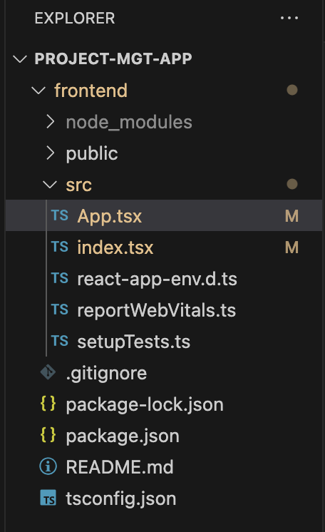
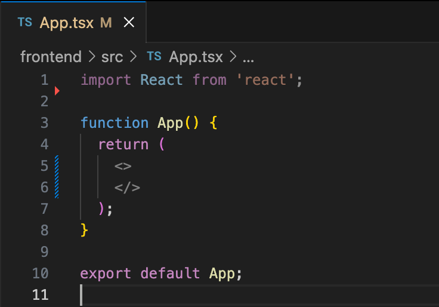
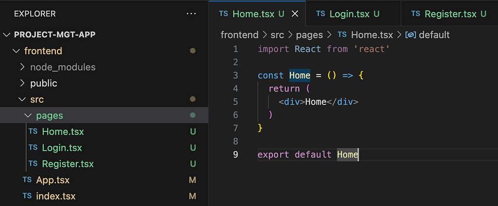
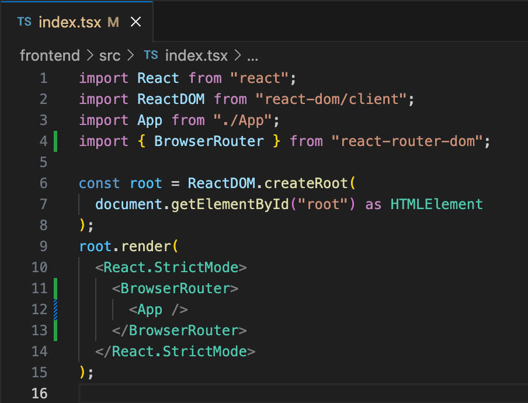
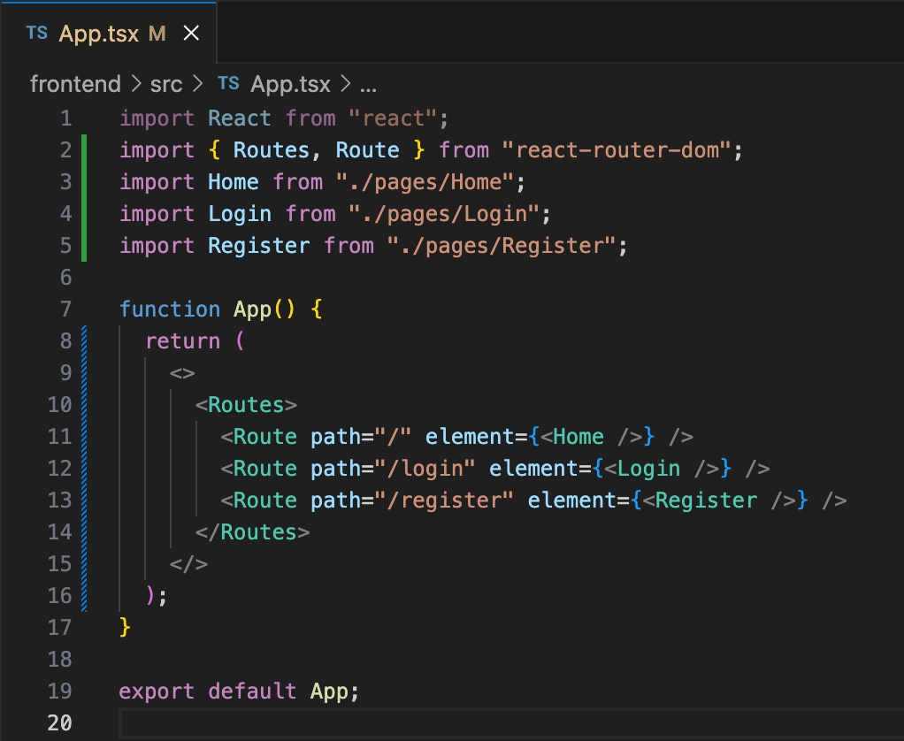
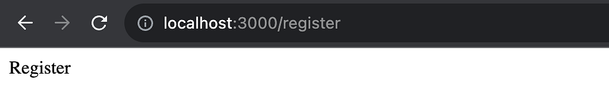
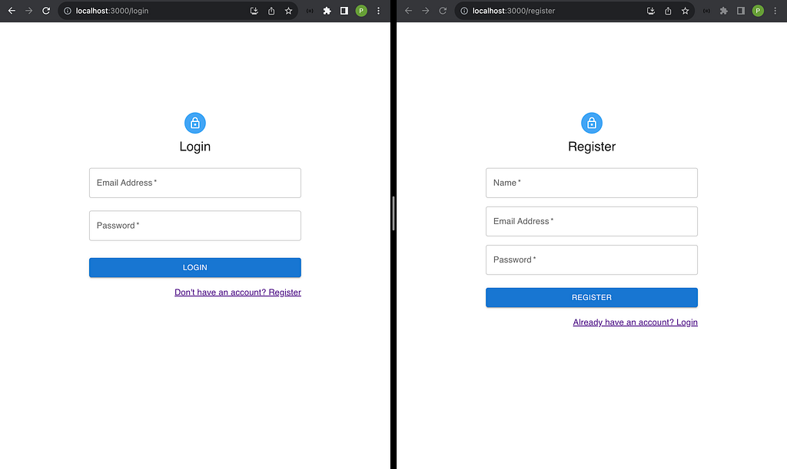

This is the first part of a series to implement the authentication and authorization process for a full stack application.

Here, we’ll create a React app using **TypeScript** and use **MUI** to create the UI, and **React Router V6** for client-side routing. I’m using [create-react-app](https://create-react-app.dev/docs/getting-started) to create the React app.

### 1. Creating the React app

Open the terminal and cd to the folder where you want to create the app. Run below command. This will create a React app named “frontend” in TypeScript.

```bash
npx create-react-app frontend --template typescript
```

Open the application in VS Code. Open the terminal in VS Code and run below command.

```bash
npm start
```

Your app will be served in [http://localhost:3000/](http://localhost:3000/)

We don’t need some of the files created under our application folder. Remove these files (App.css, App.test.tsx, index.css, logo.svg) and your file structure should be as below.



_Initial folder structure_

Remove the index.css import from **index.tsx** file. Update the **App.tsx** file as below.



_Initial App.tsx file_

Now we can continue with the implementation of the app.

### 2. Client-side routing using React Router

Run the following command to install the package.

```bash
npm i react-router-dom
```

Create 3 files under a **pages** **folder** as below, with basic implementation.



_Folder structure for pages_

Import **BrowserRouter** in **index.tsx** file and wrap **App** component with it as below.



_BrowserRouter usage in index.tsx_

In App.tsx file, import the components created for the pages and implement the routing as below.



_Routing in App.tsx_

Now if you restart the app (npm start), you’ll be able to view each page by typing the links in the address bar.



_Basic frontend app in localhost_

### 3. UI implementation (Login / Register)

I’m using MUI [free templates](https://mui.com/material-ui/getting-started/templates/) for Login and Register pages, with a few updates.

First install mui, its dependencies and icons using below command.

```bash
npm i @mui/material @emotion/react @emotion/styled @mui/icons-material
```

Add below code to **Login.tsx** to implement the UI and to handle input field data.

```tsx
import { LockOutlined } from "@mui/icons-material";
import {
  Container,
  CssBaseline,
  Box,
  Avatar,
  Typography,
  TextField,
  Button,
  Grid,
} from "@mui/material";
import { useState } from "react";
import { Link } from "react-router-dom";

const Login = () => {
  const [email, setEmail] = useState("");
  const [password, setPassword] = useState("");

  const handleLogin = () => {};

  return (
    <>
      <Container maxWidth="xs">
        <CssBaseline />
        <Box
          sx={{
            mt: 20,
            display: "flex",
            flexDirection: "column",
            alignItems: "center",
          }}
        >
          <Avatar sx={{ m: 1, bgcolor: "primary.light" }}>
            <LockOutlined />
          </Avatar>
          <Typography variant="h5">Login</Typography>
          <Box sx={{ mt: 1 }}>
            <TextField
              margin="normal"
              required
              fullWidth
              id="email"
              label="Email Address"
              name="email"
              autoFocus
              value={email}
              onChange={(e) => setEmail(e.target.value)}
            />

            <TextField
              margin="normal"
              required
              fullWidth
              id="password"
              name="password"
              label="Password"
              type="password"
              value={password}
              onChange={(e) => {
                setPassword(e.target.value);
              }}
            />

            <Button
              fullWidth
              variant="contained"
              sx={{ mt: 3, mb: 2 }}
              onClick={handleLogin}
            >
              Login
            </Button>
            <Grid container justifyContent={"flex-end"}>
              <Grid item>
                <Link to="/register">Don't have an account? Register</Link>
              </Grid>
            </Grid>
          </Box>
        </Box>
      </Container>
    </>
  );
};

export default Login;
```

Add below code to **Register.tsx** to implement the UI and to handle input field data.

```tsx
import {
  Avatar,
  Box,
  Button,
  Container,
  CssBaseline,
  Grid,
  TextField,
  Typography,
} from "@mui/material";
import { LockOutlined } from "@mui/icons-material";
import { useState } from "react";
import { Link } from "react-router-dom";

const Register = () => {
  const [name, setName] = useState("");
  const [email, setEmail] = useState("");
  const [password, setPassword] = useState("");

  const handleRegister = async () => {};

  return (
    <>
      <Container maxWidth="xs">
        <CssBaseline />
        <Box
          sx={{
            mt: 20,
            display: "flex",
            flexDirection: "column",
            alignItems: "center",
          }}
        >
          <Avatar sx={{ m: 1, bgcolor: "primary.light" }}>
            <LockOutlined />
          </Avatar>
          <Typography variant="h5">Register</Typography>
          <Box sx={{ mt: 3 }}>
            <Grid container spacing={2}>
              <Grid item xs={12}>
                <TextField
                  name="name"
                  required
                  fullWidth
                  id="name"
                  label="Name"
                  autoFocus
                  value={name}
                  onChange={(e) => setName(e.target.value)}
                />
              </Grid>

              <Grid item xs={12}>
                <TextField
                  required
                  fullWidth
                  id="email"
                  label="Email Address"
                  name="email"
                  value={email}
                  onChange={(e) => setEmail(e.target.value)}
                />
              </Grid>
              <Grid item xs={12}>
                <TextField
                  required
                  fullWidth
                  name="password"
                  label="Password"
                  type="password"
                  id="password"
                  value={password}
                  onChange={(e) => setPassword(e.target.value)}
                />
              </Grid>
            </Grid>
            <Button
              fullWidth
              variant="contained"
              sx={{ mt: 3, mb: 2 }}
              onClick={handleRegister}
            >
              Register
            </Button>
            <Grid container justifyContent="flex-end">
              <Grid item>
                <Link to="/login">Already have an account? Login</Link>
              </Grid>
            </Grid>
          </Box>
        </Box>
      </Container>
    </>
  );
};

export default Register;
```

The UIs will be updated as below.



_Login and Register pages_

When we click Login / Register buttons, handleLogin() / handleRegister() functions will be called. We haven’t included anything inside those functions yet.

We have to **validate** the form fields and show an error message if any validation fails. If the validation is successful, we have to initiate an API request to the backend, in order to handle the functionalities.

Follow me and stay tuned! If you have any questions, let me know in the comments!

### Next Steps

We’ll use **Redux Toolkit** for the state management of the application, and **Axios** to initiate the API requests (login, register, logout, profile).

Next we’ll handle error/success message alerts in a centralized way (using **Redux Toolkit** and **MUI** for the message UI).

After that we’ll update the frontend code with **redirects** and **protected routes** based on whether the user is logged in or not (authenticated or not).

[Manage your React (TypeScript) application state using Redux Toolkit](/blog/redux-toolkit-state-management/)

We’ll implement the backend using **Express** with **TypeScript**, and use **MongoDB** for the database.

[Create a backend application using Express (TypeScript) and handle authentication](/blog/express-typescript-authentication/)

Finally, we’ll handle **authorization** for the frontend and backend applications, using **Role Based Access Control**.

Then we’ll continue to add more features to the application.
