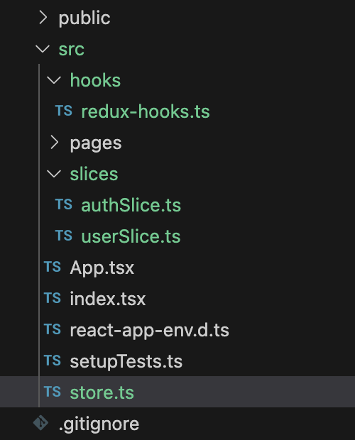
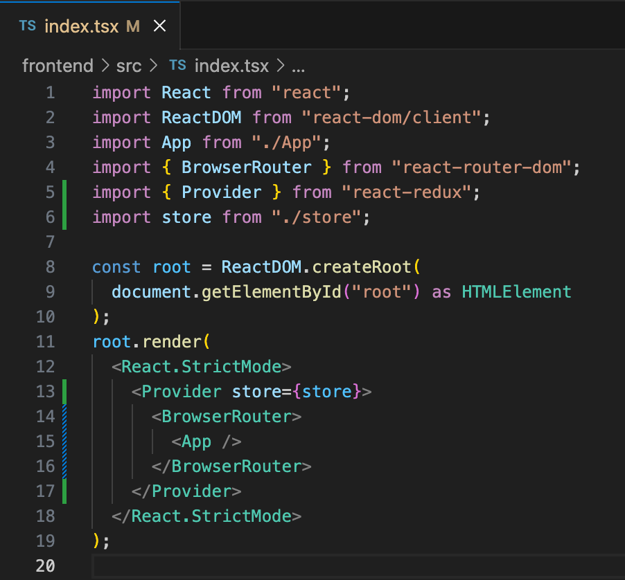

**Redux** is a JS library that can be used to manage the application state in your app in a centralized way. You’ll be retrieving the application state (the state that’s used globally or in multiple components) from a centralized location and will be performing centrally defined actions to update the state.

When your application grows, having a centralized way to manage the application state will be much easier. This is the reason we’re going to use Redux in our application.

Using the **Redux Toolkit** is the recommended way to implement state management using Redux. Unlike Redux, Redux Toolkit has **less boilerplate code and is easy to use**.

If you already have a frontend application created, you can use this article as a reference to use Redux Toolkit and axios in your application. If you don’t have one, you can follow the [previous article](/blog/react-typescript-login-register/) of the series to create an application with Login/Register/Home pages.

### 1. Setup Redux for the application

Let’s start by running the below command to install Redux Toolkit and React Redux libraries.

```bash
npm install @reduxjs/toolkit react-redux
```

Create the following folders and files needed for the redux store, slices and hooks.



_Folder / file structure for redux implementation_

Include the following initial code to the slices.

authSlice.ts

```ts
import { createSlice } from "@reduxjs/toolkit";

const authSlice = createSlice({
  name: "auth",
  initialState: "",
  reducers: {},
});

export default authSlice.reducer;
```

userSlice.ts

```ts
import { createSlice } from "@reduxjs/toolkit";

const userSlice = createSlice({
  name: "user",
  initialState: "",
  reducers: {},
});

export default userSlice.reducer;
```

You can create **separate slices for each of your feature**, and import them to your **store**.

store.ts

```ts
import { configureStore } from "@reduxjs/toolkit";
import authReducer from "./slices/authSlice";
import userReducer from "./slices/userSlice";

const store = configureStore({
  reducer: {
    auth: authReducer,
    user: userReducer,
  },
});

export type RootState = ReturnType<typeof store.getState>;
export type AppDispatch = typeof store.dispatch;

export default store;
```

According to what we have defined above, we can access the state managed by authReducer through **_state.auth_** and state managed by userReducer through **_state.user_**.

Since we are using **TypeScript**, we need to export the types and create **custom hooks** using those types and redux-toolkit hooks (for dispatching events and accessing the store). Then we can use them in our codebase directly, otherwise we’ll have to define the types each time we use those hooks.

redux-hooks.ts

```tsx
import { useDispatch, useSelector } from "react-redux";
import type { TypedUseSelectorHook } from "react-redux";
import type { RootState, AppDispatch } from "../store";

export const useAppDispatch: () => AppDispatch = useDispatch;
export const useAppSelector: TypedUseSelectorHook<RootState> = useSelector;
```

We’ll use **_useAppDispatch()_** to dispatch an action. We can change our state by dispatching the actions we define. We’ll use **_useAppSelector()_** when we need to access the state in the store.

We need to pass our store as below, in order to access above hooks from our components.



_Wrapping App component with the Provider for the store_

### 2. Using Thunk middleware and Axios to handle async API requests

When we click Login / Register buttons, we need to send **API requests** to the backend, since those functionalities are handled in the backend. Based on the responses we receive, we can update our application state.

Let’s initiate the API requests and implement the required logic for the **slices** now. We need API requests to register, login and logout purposes. We’ll use **axios** for sending the API requests and use async **Thunk middleware** to handle the request logic (using Redux Toolkit’s **createAsyncThunk**).

Let’s install axios using below command.

```bash
npm i axios
```

We need to store the backend **base url**, in order to send the API requests. Let’s hardcode it in the **contants.ts** file. We can later change it to get the url from **.env** file (as environmental variables).

```ts
export const BACKEND_BASE_URL = "http://localhost:8000";
```

Once we create the backend, we’ll expose it via port 8000, therefore I used the above as the backend base url.

Now, when the application grows, we’ll add more slices and we’ll use axios on these slices too. Therefore it’s better to create **an instance of axios** in one place and use it everywhere. Otherwise, if we need to change the default configurations of our axios requests, we’ll have to change everywhere.

We’ll have to set **withCredentials** property to **true**, so that axios will send any **cookies** associated. The authentication mechanism I’ll be implementing includes cookies and therefore I have set this to true for each request.

Create a **api** folder in src folder and create a **axiosInstance.ts** file and include below.

```ts
import axios from "axios";
import { BACKEND_BASE_URL } from "../constants";

// Create an Axios instance with default options
const axiosInstance = axios.create({
  baseURL: BACKEND_BASE_URL,
  withCredentials: true,
});

export default axiosInstance;
```

Now update the **authSlice.ts** with the following code.

```tsx
import { createSlice, createAsyncThunk, PayloadAction } from "@reduxjs/toolkit";
import axiosInstance from "../api/axiosInstance";

type User = {
  email: string;
  password: string;
};

type NewUser = User & {
  name: string;
};

type UserBasicInfo = {
  id: string;
  name: string;
  email: string;
};

type UserProfileData = {
  name: string;
  email: string;
};

type AuthApiState = {
  basicUserInfo?: UserBasicInfo | null;
  userProfileData?: UserProfileData | null;
  status: "idle" | "loading" | "failed";
  error: string | null;
};

const initialState: AuthApiState = {
  basicUserInfo: localStorage.getItem("userInfo")
    ? JSON.parse(localStorage.getItem("userInfo") as string)
    : null,
  userProfileData: undefined,
  status: "idle",
  error: null,
};

export const login = createAsyncThunk("login", async (data: User) => {
  const response = await axiosInstance.post("/login", data);
  const resData = response.data;

  localStorage.setItem("userInfo", JSON.stringify(resData));

  return resData;
});

export const register = createAsyncThunk("register", async (data: NewUser) => {
  const response = await axiosInstance.post(
    "/register",
    data
  );
  const resData = response.data;

  localStorage.setItem("userInfo", JSON.stringify(resData));

  return resData;
});

export const logout = createAsyncThunk("logout", async () => {
  const response = await axiosInstance.post("/logout", {});
  const resData = response.data;

  localStorage.removeItem("userInfo");

  return resData;
});

export const getUser = createAsyncThunk(
  "users/profile",
  async (userId: string) => {
    const response = await axiosInstance.get(
      `/users/${userId}`
    );
    return response.data;
  }
);

const authSlice = createSlice({
  name: "auth",
  initialState,
  reducers: {},
  extraReducers: (builder) => {
    builder
      .addCase(login.pending, (state) => {
        state.status = "loading";
        state.error = null;
      })
      .addCase(
        login.fulfilled,
        (state, action: PayloadAction<UserBasicInfo>) => {
          state.status = "idle";
          state.basicUserInfo = action.payload;
        }
      )
      .addCase(login.rejected, (state, action) => {
        state.status = "failed";
        state.error = action.error.message || "Login failed";
      })

      .addCase(register.pending, (state) => {
        state.status = "loading";
        state.error = null;
      })
      .addCase(
        register.fulfilled,
        (state, action: PayloadAction<UserBasicInfo>) => {
          state.status = "idle";
          state.basicUserInfo = action.payload;
        }
      )
      .addCase(register.rejected, (state, action) => {
        state.status = "failed";
        state.error = action.error.message || "Registration failed";
      })

      .addCase(logout.pending, (state) => {
        state.status = "loading";
        state.error = null;
      })
      .addCase(logout.fulfilled, (state, action) => {
        state.status = "idle";
        state.basicUserInfo = null;
      })
      .addCase(logout.rejected, (state, action) => {
        state.status = "failed";
        state.error = action.error.message || "Logout failed";
      })

      .addCase(getUser.pending, (state) => {
        state.status = "loading";
        state.error = null;
      })
      .addCase(getUser.fulfilled, (state, action) => {
        state.status = "idle";
        state.userProfileData = action.payload;
      })
      .addCase(getUser.rejected, (state, action) => {
        state.status = "failed";
        state.error = action.error.message || "Get user profile data failed";
      });
  },
});

export default authSlice.reducer;
```

In the above code, we export 4 functions that initiate API requests; login, register, logout and getUser. Inside **_extraReducers_**_,_ we handle each case for the each function and set the state as needed. When the user registers / logs in, we save the user data receives from the responses to **_basicUserInfo_**. This is the state we use to validate if the user is **authenticated or not**. In logout, we make this state **_null_**.

When the user successfully registers / logs in, we save the **_userInfo_** in **local storage**, so that even when the user refreshes the page / revisits the app, we can access the local storage and confirm that the user is authenticated. When user logs out, we clear the userInfo in local storage.

**_getUser()_** is implemented to demonstrate the authentication process in backend (we’ll implement this later). It retrieves the user’s profile data, if the user is authenticated.

I’m including a **Logout** button in **Home.tsx** until we implement a navigation bar later. I’ll include the Profile section in the same file **for the moment**.

```tsx
import React, { useEffect } from "react";
import { Button } from "@mui/material";
import { useAppDispatch, useAppSelector } from "../hooks/redux-hooks";
import { getUser, logout } from "../slices/authSlice";
import { useNavigate } from "react-router-dom";

const Home = () => {
  const dispatch = useAppDispatch();
  const navigate = useNavigate();

  const basicUserInfo = useAppSelector((state) => state.auth.basicUserInfo);
  const userProfileInfo = useAppSelector((state) => state.auth.userProfileData);

  useEffect(() => {
    if (basicUserInfo) {
      dispatch(getUser(basicUserInfo.id));
    }
  }, [basicUserInfo]);

  const handleLogout = async () => {
    try {
      await dispatch(logout()).unwrap();
      navigate("/login");
    } catch (e) {
      console.error(e);
    }
  };

  return (
    <>
      <h1>Home</h1>
      <h4>Name: {userProfileInfo?.name}</h4>
      <h4>Email: {userProfileInfo?.email}</h4>
      <Button variant="contained" sx={{ mt: 3, mb: 2 }} onClick={handleLogout}>
        Logout
      </Button>
    </>
  );
};

export default Home;
```

Here, if we have **_basicUserInfo_** (meaning that the user is logged in), we dispatch **_getUser()_** to retrieve the profile information. If the user clicks logout button, **_logout()_** will be dispatched and the user will be navigated to login page. Please note the usage of useAppDispatch, useAppSelector, useNavigate, unwrap here.

Login.tsx

```tsx
import { LockOutlined } from "@mui/icons-material";
import {
  Container,
  CssBaseline,
  Box,
  Avatar,
  Typography,
  TextField,
  Button,
  Grid,
} from "@mui/material";
import { useState } from "react";
import { Link } from "react-router-dom";
import { useAppDispatch } from "../hooks/redux-hooks";
import { login } from "../slices/authSlice";

const Login = () => {
  const dispatch = useAppDispatch();

  const [email, setEmail] = useState("");
  const [password, setPassword] = useState("");

  const handleLogin = async () => {
    // This is only a basic validation of inputs. Improve this as needed.
    if (email && password) {
      try {
        await dispatch(
          login({
            email,
            password,
          })
        ).unwrap();
      } catch (e) {
        console.error(e);
      }
    } else {
      // Show an error message.
    }
  };

  return (
    <>
      <Container maxWidth="xs">
        <CssBaseline />
        <Box
          sx={{
            mt: 20,
            display: "flex",
            flexDirection: "column",
            alignItems: "center",
          }}
        >
          <Avatar sx={{ m: 1, bgcolor: "primary.light" }}>
            <LockOutlined />
          </Avatar>
          <Typography variant="h5">Login</Typography>
          <Box sx={{ mt: 1 }}>
            <TextField
              margin="normal"
              required
              fullWidth
              id="email"
              label="Email Address"
              name="email"
              autoFocus
              value={email}
              onChange={(e) => setEmail(e.target.value)}
            />

            <TextField
              margin="normal"
              required
              fullWidth
              id="password"
              name="password"
              label="Password"
              type="password"
              value={password}
              onChange={(e) => {
                setPassword(e.target.value);
              }}
            />

            <Button
              fullWidth
              variant="contained"
              sx={{ mt: 3, mb: 2 }}
              onClick={handleLogin}
            >
              Login
            </Button>
            <Grid container justifyContent={"flex-end"}>
              <Grid item>
                <Link to="/register">Don't have an account? Register</Link>
              </Grid>
            </Grid>
          </Box>
        </Box>
      </Container>
    </>
  );
};

export default Login;
```

Register.tsx

```tsx
import {
  Avatar,
  Box,
  Button,
  Container,
  CssBaseline,
  Grid,
  TextField,
  Typography,
} from "@mui/material";
import { LockOutlined } from "@mui/icons-material";
import { useState } from "react";
import { Link } from "react-router-dom";
import { useAppDispatch } from "../hooks/redux-hooks";
import { register } from "../slices/authSlice";

const Register = () => {
  const dispatch = useAppDispatch();

  const [name, setName] = useState("");
  const [email, setEmail] = useState("");
  const [password, setPassword] = useState("");

  const handleRegister = async () => {
    // This is only a basic validation of inputs. Improve this as needed.
    if (name && email && password) {
      try {
        await dispatch(
          register({
            name,
            email,
            password,
          })
        ).unwrap();
      } catch (e) {
        console.error(e);
      }
    } else {
      // Show an error message.
    }
  };

  return (
    <>
      <Container maxWidth="xs">
        <CssBaseline />
        <Box
          sx={{
            mt: 20,
            display: "flex",
            flexDirection: "column",
            alignItems: "center",
          }}
        >
          <Avatar sx={{ m: 1, bgcolor: "primary.light" }}>
            <LockOutlined />
          </Avatar>
          <Typography variant="h5">Register</Typography>
          <Box sx={{ mt: 3 }}>
            <Grid container spacing={2}>
              <Grid item xs={12}>
                <TextField
                  name="name"
                  required
                  fullWidth
                  id="name"
                  label="Name"
                  autoFocus
                  value={name}
                  onChange={(e) => setName(e.target.value)}
                />
              </Grid>

              <Grid item xs={12}>
                <TextField
                  required
                  fullWidth
                  id="email"
                  label="Email Address"
                  name="email"
                  value={email}
                  onChange={(e) => setEmail(e.target.value)}
                />
              </Grid>
              <Grid item xs={12}>
                <TextField
                  required
                  fullWidth
                  name="password"
                  label="Password"
                  type="password"
                  id="password"
                  value={password}
                  onChange={(e) => setPassword(e.target.value)}
                />
              </Grid>
            </Grid>
            <Button
              fullWidth
              variant="contained"
              sx={{ mt: 3, mb: 2 }}
              onClick={handleRegister}
            >
              Register
            </Button>
            <Grid container justifyContent="flex-end">
              <Grid item>
                <Link to="/login">Already have an account? Login</Link>
              </Grid>
            </Grid>
          </Box>
        </Box>
      </Container>
    </>
  );
};

export default Register;
```

### 3. Routes based on authentication status

If the user is **not authenticated** (**_basicUserInfo_** is not available), then we should **not** allow the user to enter any of the **protected routes**. In our case, the Home page is restricted and therefore “/” route should **only be available to authenticated users**. If the user tries to enter Home page by updating the url in the address bar, Home **must not render** and the user should be **redirected to Login page**.

Let’s implement a separate component to handle this, and then update our **routes** to wrap the protected routes with the route of this component. We use the features of **React Router V6** to achieve this. We’ll use the same component to add a common layout later (eg: nav bar).

Create a **layouts** folder and add a **ProtectedLayout.tsx** file.

```tsx
import React from "react";
import { Link, Outlet } from "react-router-dom";
import { useAppDispatch, useAppSelector } from "../hooks/redux-hooks";
import { Navigate } from "react-router-dom";

const ProtectedLayout = () => {
  const basicUserInfo = useAppSelector((state) => state.auth.basicUserInfo);

  if (!basicUserInfo) {
    return <Navigate replace to={"/login"} />;
  }

  return (
    <>
      <Outlet />
    </>
  );
};

export default ProtectedLayout;
```

Let’s create another file as **DefaultLayout.tsx** too to handle redirecting from Login/Register to Home page if the user is **already logged in**.

```tsx
import React from "react";
import { Link, Outlet } from "react-router-dom";
import { useAppDispatch, useAppSelector } from "../hooks/redux-hooks";
import { Navigate } from "react-router-dom";

const DefaultLayout = () => {
  const basicUserInfo = useAppSelector((state) => state.auth.basicUserInfo);

  if (basicUserInfo) {
    return <Navigate replace to={"/"} />;
  }

  return (
    <>
      <Outlet />
    </>
  );
};

export default DefaultLayout;
```

Now let’s update the **routes** in the **App.tsx** to use respective layout.

```tsx
import React from "react";
import { Routes, Route } from "react-router-dom";
import Home from "./pages/Home";
import Login from "./pages/Login";
import Register from "./pages/Register";
import DefaultLayout from "./layouts/DefaultLayout";
import ProtectedLayout from "./layouts/ProtectedLayout";

function App() {
  return (
    <>
      <Routes>
        <Route element={<DefaultLayout />}>
          <Route path="/login" element={<Login />} />
          <Route path="/register" element={<Register />} />
        </Route>
        <Route element={<ProtectedLayout />}>
          <Route path="/" element={<Home />} />
        </Route>
      </Routes>
    </>
  );
}

export default App;
```

Now you’re using Redux in your application, and handle API requests as well. If you’re following the series, this is it for the **authentication part** from **frontend** side.

Visit [this GitHub link](https://github.com/Prabashi/project-mgt-app-frontend/tree/auth) to view the full implementation up to now.

Now, you’ll need to show **error/success message alerts** based on validations, response success / failure etc. We can implement this feature by using redux to handle the state of the alert. View the article [here](/blog/react-notifications-redux-middleware/).

Follow me and stay tuned! If you have any questions, let me know in the comments!

### Next Steps

We’ll implement the backend using **Express** with **TypeScript**, and use **MongoDB** for the database.

[Create a backend application using Express (TypeScript) and handle authentication](/blog/express-typescript-authentication/)

Finally, we’ll handle **authorization** for the frontend and backend applications, using **Role Based Access Control**.

Then we’ll continue to add more features to the application.

### Previous Steps

Create a React app with Login / Register pages.

[Create a simple React app (TypeScript) with Login / Register pages using create-react-app](/blog/react-typescript-login-register/)
